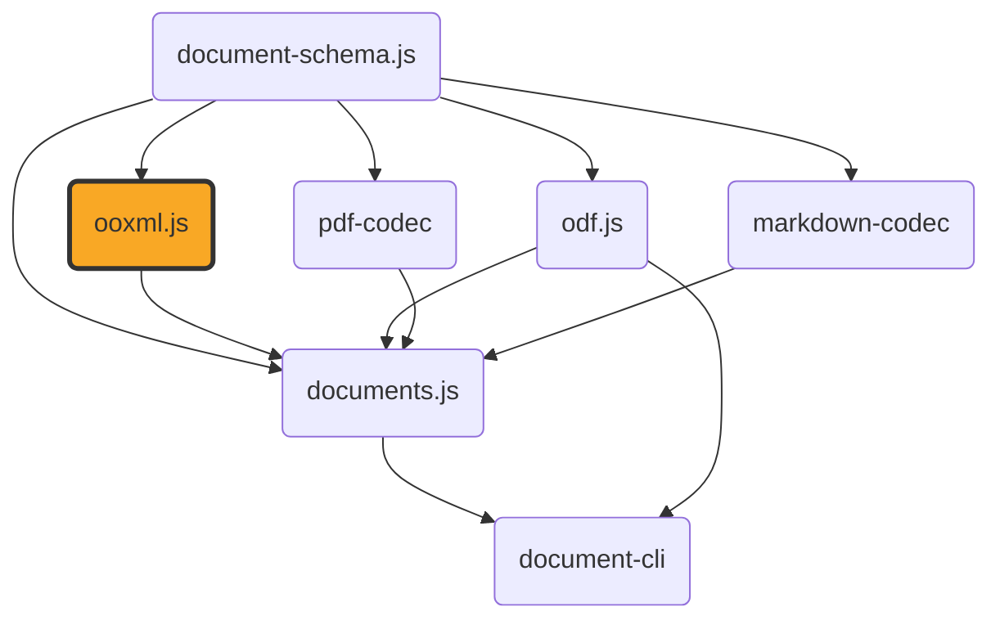

# ooxml.js

[](https://github.com/ExaDev/ooxml.js) [](https://www.npmjs.com/package/ooxml.js) [](https://github.com/ExaDev/ooxml.js/releases/latest) [](https://github.com/ExaDev/ooxml.js/actions)

> Type-safe, lossless round-trip conversion between OOXML packages (`.docx`, `.pptx`, `.xlsx`) and a faithful JSON model, built on [Zod 4](https://zod.dev) codecs.

An OOXML file is a ZIP archive of parts (an OPC "package"): `[Content_Types].xml`, relationships (`*.rels`), XML content parts, and binary parts (images, embedded objects). `ooxml.js` decodes the **whole package** into a faithful JSON model and encodes it back — part for part — so `encode(decode(file))` reproduces the original content.



## Why

Semantic, typed document models are lossy and one-directional: they cannot round-trip. True round-trip requires capturing every part, relationship, and binary byte-for-byte at the content level. `ooxml.js` provides that lossless generic foundation, with ergonomic typed reading views (`Document`, `Presentation`, `Workbook`) layered on top for convenient access.

## Getting started

Requires Node.js `>=20` and pnpm `11.6.0` (pinned via `packageManager` in `package.json`).

```sh
pnpm install
```

Install as a dependency in another project:

```sh
pnpm add ooxml.js
# or
npm install ooxml.js
```

## Usage

```ts
import { decodePackage, encodePackage } from 'ooxml.js';

// .docx / .pptx / .xlsx bytes -> faithful JSON Package
const pkg = decodePackage(new Uint8Array(await file.arrayBuffer()));

// ...inspect or modify pkg.parts...

// Package -> bytes (content-identical to the original)
const bytes = encodePackage(pkg);
```

The core is a Zod 4 codec, so both directions are schema-validated:

```ts
import { z } from 'zod';
import { packageCodec } from 'ooxml.js';

const pkg = z.decode(packageCodec, bytes);
const out = z.encode(packageCodec, pkg);
```

Typed reading views project the generic `Package` into ergonomic models (lossy; for reading, not round-trip). `readDocx`/`readPptx` resolve the full style/theme cascade, so document order, run/paragraph styling, and geometry all come through, not just flattened text:

```ts
import { decodePackage, readDocx } from 'ooxml.js';

const doc = readDocx(decodePackage(bytes));
// doc.sections[0].blocks holds paragraphs/tables/page-breaks in document order (including
// inside tables); each run already carries its cascade-resolved bold/italic/colour/font.
```

`readXlsx` is the equivalent lossy, cell-values-only view for xlsx (see below). Alongside it, `readXlsxContent`/`buildXlsxPackage` are a separate, `ContentDocument`-shaped pair — a richer reader (column widths, row heights, hidden rows/columns, merged ranges, every cell value kind xlsx distinguishes, and print settings) matched with this package's first writer, so a caller can round-trip a spreadsheet through the same `ContentDocument` shape `documents.js` and `odf.js` already use:

```ts
import { buildXlsxPackage, decodePackage, readXlsxContent } from 'ooxml.js';

const content = readXlsxContent(decodePackage(bytes)); // ContentDocument, kind: 'spreadsheet'
const pkg = buildXlsxPackage(content); // a fresh Package built from scratch, not a write-back into `pkg`
```

Every module under `src/` is also importable directly, by the same path it has relative to `src/`, without going through the barrel — useful for a caller that only needs one small piece and wants to avoid pulling in the rest:

```ts
import { bytesToBase64, base64ToBytes } from 'ooxml.js/util/base64';
import { readXlsxContent } from 'ooxml.js/typed/xlsx/content';
```

## The ooxml.js format

The verbose `Package` JSON is faithful but repetitive: every node repeats its `type`/`tag`/`attributes`/`children` keys, and tag and namespace strings recur thousands of times across a real document. **The ooxml.js format** is a compact, still-plain-JSON alternative — tuple-encoded nodes plus a single interned string table — that composes on top of `packageCodec` without changing what it guarantees:

```
OOXML bytes --[packageCodec]--> Package --[compactCodec]--> CompactPackage (the ooxml.js format)
```

```ts
import { decodePackage, toCompact, fromCompact } from 'ooxml.js';

const pkg = decodePackage(bytes);
const compact = toCompact(pkg); // { s: string[], p: Record<path, CompactPart> }
const roundTripped = fromCompact(compact); // deep-equals pkg
```

For example, a `word/document.xml` part holding a single run of text:

```xml
<w:p><w:r><w:t>Hi</w:t></w:r></w:p>
```

decodes to this `Package` (one entry in `parts`, each element an `XmlNode`):

```json
{
  "parts": {
    "word/document.xml": {
      "kind": "xml",
      "nodes": [
        {
          "type": "element",
          "tag": "w:p",
          "attributes": [],
          "children": [
            {
              "type": "element",
              "tag": "w:r",
              "attributes": [],
              "children": [
                {
                  "type": "element",
                  "tag": "w:t",
                  "attributes": [],
                  "children": [{ "type": "text", "value": "Hi" }]
                }
              ]
            }
          ]
        }
      ]
    }
  }
}
```

`toCompact` interns every tag and text value once, in first-occurrence order, and replaces each node with a tuple (a leading type code — `0` for element, `1` for text — followed by string-table indices):

```json
{
  "s": ["w:p", "w:r", "w:t", "Hi"],
  "p": {
    "word/document.xml": [[0, 0, [], [[0, 1, [], [[0, 2, [], [[1, 3]]]]]]]]
  }
}
```

Reading the outer tuple: `[0, 0, [], [...]]` is an element (`0`) whose tag is `s[0]` (`"w:p"`), with no attributes (`[]`), wrapping one child — the same shape recursively for `w:r` and `w:t`, down to the text leaf `[1, 3]` (type `1` = text, value `s[3]` = `"Hi"`).

It is a JSON shape, not a compression layer: every string is still human-readable text, so it stays diffable and debuggable, just without the repeated structural keys and duplicate strings of the verbose `Package` model. `fromCompact(toCompact(pkg))` round-trips exactly, and `toCompact` is deterministic for a given `Package` value (the same input always produces the same string table).

Every pair of the three formats — OOXML bytes, `Package`, and `CompactPackage` — has a direct codec, so you never have to hand-compose two calls: `packageCodec` (bytes ⇄ `Package`), `compactCodec` (`Package` ⇄ `CompactPackage`), and `compactPackageCodec` (bytes ⇄ `CompactPackage` directly, via `decodeCompactPackage`/`encodeCompactPackage`):

```ts
import { decodeCompactPackage, encodeCompactPackage } from 'ooxml.js';

const compact = decodeCompactPackage(bytes); // OOXML bytes -> CompactPackage directly
const out = encodeCompactPackage(compact); // CompactPackage -> OOXML bytes directly
```

## Build, test, and lint

```sh
pnpm build          # tsdown -> dist/ (one ESM + CJS + .d.ts set per source module, via tsdown.config.ts)
pnpm lint           # eslint . --max-warnings 0
pnpm typecheck      # tsc --noEmit
pnpm test           # vitest run
pnpm test:watch     # vitest
pnpm test:smoke     # builds dist/, then runs test/smoke.test.mjs to verify the built ESM and CJS artifacts both load and behave identically
```

`pnpm prepublishOnly` runs `lint`, `typecheck`, `tsdown`, `publint`, and `@arethetypeswrong/cli` (`attw --pack`) — the full publish-readiness check — before a release.

`test/smoke.test.mjs` loads the actual built `dist/index.js` (ESM) and `dist/index.cjs` (CJS) barrel artifacts and checks they load and behave identically — a check none of `vitest`'s normal run, `tsc`, `publint`, or `attw` can do, since those either run against source or statically analyse package metadata without executing the compiled output. `vitest.config.ts` defines it as its own `smoke` project (vitest's `test.projects`), separate from the `unit` project (`src/**/*.test.ts`); `pnpm test`/`test:watch` pass `--project unit` and `pnpm test:smoke` passes `--project smoke` after `tsdown` rebuilds `dist/`, so neither run touches the other project's files.

`tsdown.config.ts`'s `entry` is a glob (`src/**/*.ts`, excluding tests and `.d.ts` files) rather than a single `src/index.ts` bundle, so `dist/` holds one ESM/CJS/`.d.ts`/`.d.cts` set per source module, laid out under `dist/` at the same relative path each module has under `src/` (pinned via the sibling `root: 'src'` option). `dist/index.js`/`dist/index.cjs` are just the file `tsdown` produces for `src/index.ts`, matched by that same glob — they still re-export everything the barrel always has. `package.json`'s `exports` map adds a `"./*"` wildcard alongside `"."`, so any module is importable by its own path, not only through the barrel.

To run a single test file: `pnpm vitest run src/typed/docx.test.ts`.

## Architecture

The package is layered from a lossless core outward to lossy convenience views:

- **`src/model/`** — the schemas. `node.ts` defines `XmlNode` (`text` / `cdata` / `comment` / `declaration` / `pi` / `element`) as an ordered forest, matching XML's mixed-content model exactly. `package.ts` defines `Package` as a record of zip-entry path to `Part` (`xml` parts hold a parsed node forest; `binary` parts hold base64 bytes, keeping the whole `Package` a plain JSON value).
- **`src/xml/`** — `parse.ts` and `build.ts` convert between an XML string and the `XmlNode[]` forest, via `fast-xml-parser` in `preserveOrder` mode with entity re-encoding disabled, so element order, mixed content, and original entity encoding survive unchanged.
- **`src/zip.ts`** — thin wrapper over `fflate`'s synchronous `zipSync`/`unzipSync`, isomorphic and dependency-free.
- **`src/package-io/`** — `read.ts` and `write.ts` sit between the zip and XML layers: unzip a package into path -> bytes, classify each entry as XML or binary (`looksLikeXml` sniffs the leading non-whitespace byte for `<`), and parse/serialize accordingly.
- **`src/codec.ts`** — the public round-trip surface: `packageCodec`/`xmlCodec` are `z.codec()` pairs, and `decodePackage`/`encodePackage` are the ergonomic wrappers around them.
- **`src/compact.ts`** — the ooxml.js format: `compactCodec` (`z.codec(PackageSchema, CompactPackageSchema, …)`) maps `Package ⇄ CompactPackage`, with `toCompact`/`fromCompact` as the ergonomic wrappers. `compactPackageCodec` composes `packageCodec` and `compactCodec` into a direct bytes ⇄ `CompactPackage` codec (`decodeCompactPackage`/`encodeCompactPackage`), so all three format pairs — bytes/`Package`, `Package`/`CompactPackage`, bytes/`CompactPackage` — have a named codec rather than requiring callers to chain two.
- **`src/typed/`** — one-way, lossy projections that read the generic `Package` into ergonomic document/presentation/workbook models. `docx/` and `pptx/` share one block content model — `ContentParagraph`/`ContentTable`/`ContentImageBlock`/`ContentPageBreak`, discriminated as `ContentBlock`, imported from the sibling [`document-schema.js`](https://github.com/ExaDev/document-schema.js) package rather than defined here (see below) — instead of each keeping its own, disjoint shape: `readDocx` resolves the full WordprocessingML style cascade (`docx/styles.ts`: `docDefaults` → named-style `basedOn` chains → paragraph-mark run properties → character styles → direct formatting) into ordered `sections` of paragraphs/tables/page-breaks (document order preserved, including inside tables), plus `comments`, `footnotes`, and `headers`/`footers`; `readPptx` resolves the placeholder → layout → master → theme inheritance cascade (`pptx/inherit.ts`) into `slides` of positioned, styled `shapes` (geometry, run/paragraph formatting, embedded images, tables, speaker notes) in presentation order (`p:sldIdLst`, never slide filename order); `readXlsx` covers cell values and formulas, merged ranges and defined names. `typed/shared/` holds the OOXML-specific primitives both `docx/` and `pptx/` build on: `drawingml.ts` (DrawingML `a:xfrm` geometry, theme/colour resolution, group-transform composition — including `ColorTransform`/`applyColorTransforms`, the shade/tint/lumMod/lumOff cascade maths, which stays here rather than in `document-schema.js` since it's OOXML-cascade-resolution logic, not a content-model shape), `units.ts` (OOXML unit conversions — EMU/twip/half-point), `metadata.ts` (`docProps/core.xml` + `docProps/app.xml` → `DocumentMetadata`, shared verbatim across docx/pptx/xlsx), and `source-path.ts` (stamps a deterministic, document-order path like `sections[0].blocks[2].runs[1]` onto every `ContentRun`/`ContentBlock`/`ContentShape`, so a downstream consumer can trace a rendered item back to where it came from — see `document-schema.js`'s own `sourcePath` field). Geometry (`Box`/`PageSize`/`Margins`), colour (`Color`/`ColorSchema`), and alignment (`Alignment`) types are imported from `document-schema.js`, not defined locally. `src/image/sniff.ts` (magic-byte PNG/JPEG detection) supports `readPptx`'s picture-shape reading. None of `readDocx`/`readPptx`/`readXlsx` can be encoded back to a `Package` — round-tripping those always goes through `decodePackage`/`encodePackage`, never through a typed view; see `src/typed/xlsx/` below for this package's one write-back exception. `typed/util.ts` holds the shared XML-walking helpers (`walk`, `elementsWithTag`, `childrenWithTag`, `attr`, `rootElement`, `textContent`, entity decoding, `resolveRelationships`) every typed reader builds on.
- **`src/typed/xlsx/`** — a second, `ContentDocument`-shaped xlsx pair alongside the lossy `readXlsx` above, not a replacement for it (both stay exported; they serve different callers). `content.ts`'s `readXlsxContent` reads a `Package` straight into `ContentDocument` (`kind: 'spreadsheet'`): real column widths, row heights, hidden rows/columns, merged ranges (resolved onto the anchor cell's `colSpan`/`rowSpan`), every cell value kind xlsx itself distinguishes, and a genuinely populated `ContentSheetPrintSettings` — matching the bar the sibling `odf.js` package's own `readOds` already sets, rather than `readXlsx`'s flattened `XlsxWorkbook`/`XlsxCell` shape. `build.ts`'s `buildXlsxPackage` is `readXlsxContent`'s write-side inverse and this package's first writer of genuinely new content: given a `ContentDocument`, it constructs a complete xlsx `Package` from scratch — workbook, worksheets, a minimal-but-real `xl/styles.xml`, shared strings, core/app properties — via `xml/fragment.ts`'s `el`/`txt`, rather than editing whatever package `readXlsxContent` itself decoded. Both stay scoped to what `ContentDocument`'s `spreadsheet` variant models: no number-format engine (a numeric cell's percentage/currency/date semantics live in `xl/styles.xml`'s own `numFmt` codes, which neither side interprets) and no per-cell rich-text runs.

## Conventions

- **Zod-first schema/type/guard.** Every model type is inferred from its Zod schema (`z.infer<typeof XSchema>`), not hand-written — schema, type, and validator stay in lockstep.
- **`XmlNode` uses a recursive structural guard, not `z.lazy`.** `z.lazy` collapses to `unknown` for the element-children case in the Zod version this project pins, so `XmlElementSchema` validates `children` via `z.custom<XmlNode>(isXmlNode)`, a hand-written recursive type guard in `model/node.ts`. Any change to `XmlNode`'s shape must update `isXmlNode` in step. `src/compact.ts`'s `CompactXmlNode` (`isCompactXmlNode` + `z.custom`) reuses the same pattern for the same reason; `document-schema.js`'s own `ContentBlock` (`isContentBlock` + `z.custom`, since a table cell's blocks can themselves contain a table) does too, one level up the dependency graph.
- **Lossless core vs. lossy views is a hard boundary.** `decodePackage`/`encodePackage` (and the underlying codecs) must stay byte/part faithful — every part round-trips unchanged. `src/typed/*`'s lossy readers (`readDocx`, `readPptx`, `readXlsx`) are explicitly one-way and are allowed to drop information (documented per-reader, e.g. `readDocx` resolves cached field-result text rather than re-evaluating live `PAGE`/`NUMPAGES` fields, docx's own `w:themeColor` references aren't resolved, and `readXlsx` drops cell styles, formats and charts). Don't blur this line by adding write-back support to one of those readers; a full round-trip of a package one of them decoded always goes through the generic `Package`. `readXlsxContent`/`buildXlsxPackage` (`src/typed/xlsx/`) are a deliberate, separate exception, not a violation of this rule: they were designed together as a genuine read/write pair around the shared `ContentDocument` model — matching the sibling `odf.js`/`documents.js` packages' own established convention of building fresh output from a `ContentDocument`, rather than editing a decoded package in place — and `buildXlsxPackage` never touches whatever package `readXlsxContent` itself decoded.
- **XML entities stay raw in the lossless layer.** `parseXml` runs with `processEntities: false` so encoded entities (e.g. `&amp;`) are preserved verbatim for round-trip fidelity; typed readers decode the five standard entities (`decodeEntities` in `typed/util.ts`) only in their own lossy projection, never in the core model.
- **No type assertions.** `eslint.config.ts` runs `@typescript-eslint/consistent-type-assertions` with `assertionStyle: "never"`, banning `as` and angle-bracket casts outright, with `linterOptions.noInlineConfig: true` so there is no `eslint-disable` escape hatch either — narrow with a guard or parse with Zod. An exception would have to be scoped structurally, as a `files`-matched override block in `eslint.config.ts`, not an inline comment.

## Gotchas and quirks

- **`readDocx`/`readPptx` are richer than a flat text/shape dump, but still not a round-trip path — here is what's still not captured.** Not modelled: numbering *definitions* themselves (glyph, format, restart-at-level, from `word/numbering.xml`) — only each paragraph's own `numId`/`level` *membership* is captured, so a consumer can group paragraphs into a list but can't render the list's own markers without separately reading `word/numbering.xml`; table cell border styling (`w:tcBorders`, `a:tcPr` line properties — only cell shading/fill is read); docx's own `w:themeColor` run-colour references (real-world runs overwhelmingly use direct `w:val` hex instead); live `PAGE`/`NUMPAGES` field re-evaluation (fields resolve to Word's own cached result text, correct unless a different pagination would change the value); and docx inline/floating images (`w:drawing`) — `readPptx`'s picture-shape reading (`p:pic`) has no docx-side equivalent yet. On the pptx side specifically: connector shapes (`p:cxnSp`) are skipped entirely (decorative, no text); a shape's rotation is passed through from its own local `a:xfrm/@rot` rather than composed through a rotated or flipped parent group (ECMA-376's real composition rule there is one of DrawingML's more arcane corners); and non-table graphic frames (chart/SmartArt/OLE) come through with correct geometry but empty content.
- **`test:smoke` depends on a fresh build.** It runs `tsdown && vitest run --project smoke`, so it always rebuilds `dist/` first — don't run it expecting to test a stale build.
- **`--project` matters for `test/smoke.test.mjs`.** `vitest.config.ts` defines `unit` and `smoke` as separate projects; `pnpm test`/`test:watch`/`test:smoke` always pass the right `--project` flag. A bare `vitest`/`vitest run` with no `--project` filter runs both projects, and `smoke` fails loudly (`Cannot find module '../dist/index.js'`) if `dist/` hasn't been built yet — a clear failure pointing at the cause, not a silent false pass, but still worth knowing if you invoke `vitest` directly instead of through the npm scripts.
- **Binary-vs-XML part classification is a byte sniff, not an extension check.** `package-io/read.ts`'s `looksLikeXml` looks for a leading `<` after skipping a UTF-8 BOM and whitespace; this is deliberate (no standard OOXML binary part starts with `<`) but means any future binary format starting with `<` would misclassify.
- **`Array.isArray` narrows `unknown` to `any[]`, not `unknown[]`.** `lib.es5.d.ts` types its parameter as `any`, so TypeScript can't do better even after the check succeeds — indexing straight into the result (e.g. `value[0]`) silently reintroduces `any` and trips `@typescript-eslint/no-unsafe-assignment`. `compact.ts` and `xml/parse.ts` each define a local `isUnknownArray` guard (`value is unknown[]`) for exactly this reason; reach for it instead of `Array.isArray` wherever the narrowed element is going to be read.
- **TypeScript is pinned to the latest 6.x, not 7.** TypeScript 7 restructured its JS-facing API surface heavily enough that both `typescript-eslint` (peer range `<6.1.0`) and `cosmiconfig`'s TypeScript loader (used by `semantic-release` to read `release.config.ts`, via `typescript.findConfigFile`, which TS 7 no longer exports) break under it. Upgrading past 6.x has to wait for that ecosystem tooling to add TS 7 support.
- **`release-notes-generator`'s `preset` is `angular`, not `conventionalcommits`, unlike `commit-analyzer`'s.** `conventional-changelog-conventionalcommits@10.2.1` exports its changelog body under the key `template`, but the `conventional-changelog-writer` version `@semantic-release/release-notes-generator@14.1.1` bundles only reads `options.mainTemplate` — so the body silently falls back to the writer's own generic default, whose commit partial doesn't match conventionalcommits' function-based partial signature either. The result is a changelog with a version header and nothing under it, confirmed even with zero custom configuration (`preset: 'conventionalcommits'`, no `presetConfig` at all) — not something introduced by this project's own config. `commit-analyzer` is unaffected because it only reads `whatBump` data from the same preset, no template rendering involved. Don't "fix the inconsistency" by switching `release-notes-generator` to `conventionalcommits` too without first checking whether this upstream mismatch has been resolved.

## Fidelity

Conversion is **part-content-faithful**: every XML part re-serialises to equivalent XML, every binary part to identical bytes, and no parts are dropped or added. The re-zipped file is content-identical and opens correctly in Word, Excel, and PowerPoint.

It is **not** guaranteed to be byte-for-byte identical at the ZIP-container level — re-zipping changes archive entry layout (entry order, compression, metadata), and that is not achievable deterministically across the tools that produce OOXML files.

## Release and publishing

`.github/workflows/ci.yml` runs commitlint, lint, typecheck, the unit suite, and the smoke test on every push and pull request. On a push to `main` where those all pass, `release.config.ts` drives [semantic-release](https://semantic-release.gitbook.io/semantic-release): commit history since the last tag decides the version bump, `CHANGELOG.md` and `package.json` are committed back to `main`, a GitHub Release is cut, and the package publishes to [npmjs.org](https://www.npmjs.com/package/ooxml.js) — via npm's OIDC trusted publishing, so no `NPM_TOKEN` exists anywhere in the pipeline.

Whether that release actually published a new version is detected by diffing `package.json`'s version before and after the release step, not by trusting a third-party action's own detection. Two further jobs gate on that: one republishes the same build under the scoped `@exadev/ooxml.js` alias to GitHub Packages (which has no OIDC exchange of its own, so it authenticates with `GITHUB_TOKEN` instead), and one packs the release into its own directory, generates an SPDX SBOM (`pnpm sbom`), and signs both an SBOM and a build-provenance attestation against that exact tarball — verifiable independently of the registry, and still present if the package is later unpublished.

## Contributing

Commits follow Conventional Commits (`feat:`, `fix:`, `test:`, `chore:`, …), enforced by commitlint (`commitlint.config.ts`) via a husky `commit-msg` hook and a CI `commitlint` job — semantic-release's version bump depends on these being well-formed, not just style. A husky `pre-commit` hook runs `lint-staged` (`eslint --fix` on staged `*.ts` files) and `pre-push` runs the test suite. There is a single `main` branch and no open pull request workflow established so far.

## References

- [document-schema.js](https://github.com/ExaDev/document-schema.js) — the canonical `ContentBlock`/`ContentSection`/`ContentSlide`/geometry/colour/alignment schemas `readDocx`/`readPptx` return, plus the `ContentDocument`/`LayoutMetadata` types `readXlsxContent`/`buildXlsxPackage` read and write directly, all imported here rather than defined locally — the single source of truth this package shares with `odf.js` and `documents.js` so none of the three maintains an independent, drift-prone copy.
- [odf.js](https://github.com/ExaDev/odf.js) — a sibling package doing the equivalent job for the OpenDocument Format (odt/ods/odp/odg/…), also built on `document-schema.js`.
- [documents.js](https://github.com/ExaDev/documents.js) — depends on this package for lossless OOXML handling and its cascade-resolved typed readers, adding PDF conversion and a read-and-write docx/pptx editor on top.

## License

MIT
